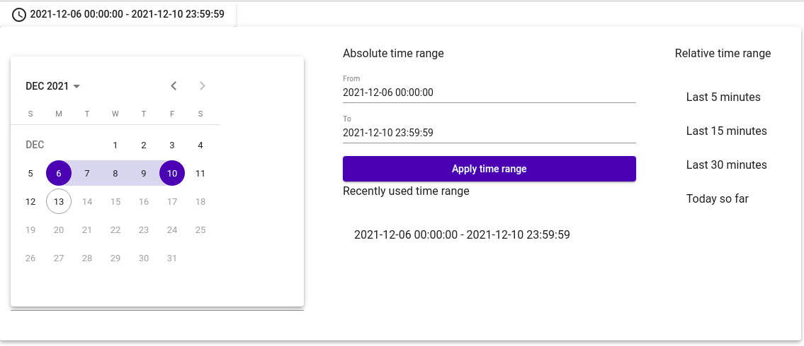

# NgxMatSmartDateTimePicker

This library add a component to select a date range _à la_ Grafana. You can pick date with the picker, use pre-defined periods or select date manualy.




## Get started
Just import the module somewhere in your application :
##### app.module.ts
```typescript
NgxSmartDateRangePickerModule.forRoot({
  lang: 'en-US' // available locales are en-GB, en-US, fr-BE, fr-CA, fr-FR
});
```

And use it in your component :
##### app.component.ts
```ts
readonly start = new Date(2020, 0, 1);
readonly today = new Date();

readonly maxRange = 10; // 10 days of max period (put 0 for unlimited)
```

##### app.component.html
```html
<ngx-mat-smart-daterange-picker [min]="start" [max]="today" [maxRange]="maxRange" [recentlyUsedTimeRangeCount]="2">
</ngx-mat-smart-daterange-picker>
```

## Options
You can define relative time range periods globally when importing module
##### app.module.ts
```typescript
const relativeTimeRanges: RelativeTimeRange[] = [
  { label: 'last5Minutes', from: 'now-5m', to: 'now' },
  { label: 'last15Minutes', from: 'now-15m', to: 'now' },
  { label: 'last30Minutes', from: 'now-30m', to: 'now' },
  { label: 'todaySoFar', from: 'now/d', to: 'now' }
];

NgxSmartDateRangePickerModule.forRoot({
  relativeTimeRanges,
  lang: 'en-US'
});
```

Or you can define it when using the component :
##### app.component.ts
```typescript
// Overload default configuration
readonly relativeTimeRanges: RelativeTimeRange[] = [
  { label: 'last5Minutes', from: 'now-5m', to: 'now' },
  { label: 'last15Minutes', from: 'now-15m', to: 'now' },
  { label: 'last30Minutes', from: 'now-30m', to: 'now' },
  { label: 'todaySoFar', from: 'now/d', to: 'now' }
];
```
#### app.component.html
```html
  <ngx-mat-smart-daterange-picker [min]="start" [max]="today" [maxRange]="maxRange" [recentlyUsedTimeRangeCount]="2" [relativeTimeRanges]="relativeTimeRanges">
  </ngx-mat-smart-daterange-picker>
```
